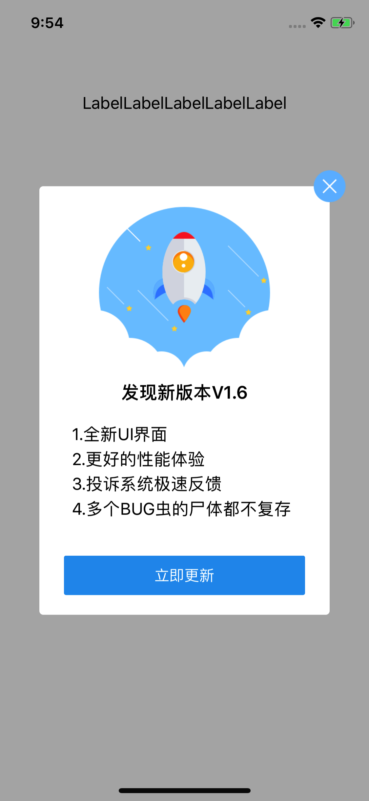

# ZASUpdateAlert

[](https://developer.apple.com/) [](https://developer.apple.com/swift/) [](https://github.com/Minecodecraft/MCScratchImageView/blob/master/LICENSE)

### 描述：自定义检查版本更新提示弹出框

---
### 效果示例图


---

## 要求
iOS 8.0+
Xcode 7.2+
Swift 4.0

## 安装

#### CocoaPods安装

```
pod 'ZASUpdateAlert', '~> 0.1.0'
```

#### 手动安装

只需将`ZASUpdateAlert`文件夹拖到项目中。


## 使用

如果是使用的是CocoaPods，第一步需要先导入ZASUpdateAlert
```
import ZASUpdateAlert
```

#### 使用示例

```Swift
ZASUpdateAlert.show(version: "V1.6", content: "1.全新UI界面\n2.更好的性能体验\n3.投诉系统极速反馈\n4.多个BUG虫的尸体都不复存在", appId: "xxxxxxxx", isMustUpdate: false)

```
## 参考项目
`https://github.com/RockChanel/SELUpdateAlert`

## 作者

赵阿申, [zhaoashen@gmail.com](http://www.devashen.com)

## License

ZASUpdateAlert is available under the MIT license. See the LICENSE file for more info.